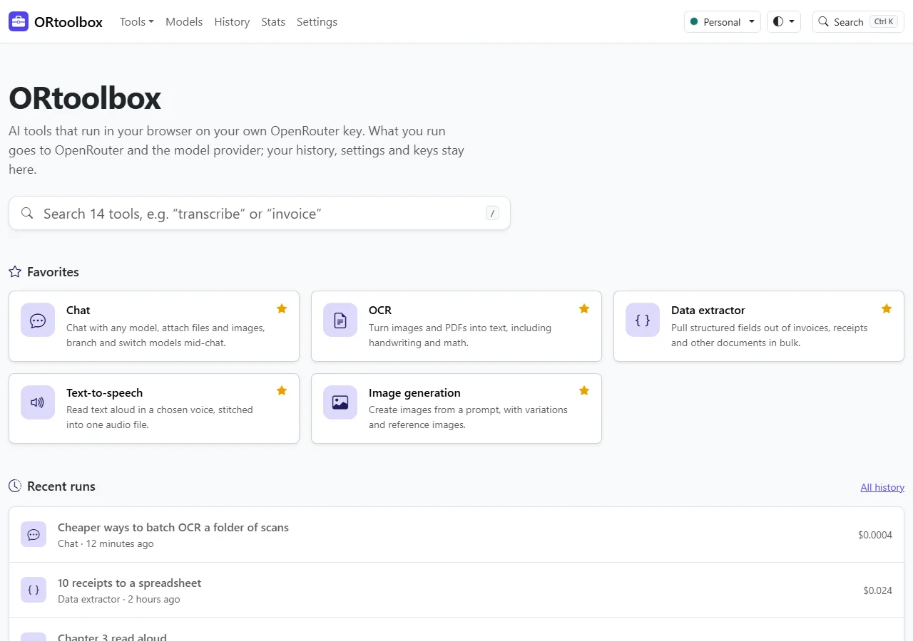
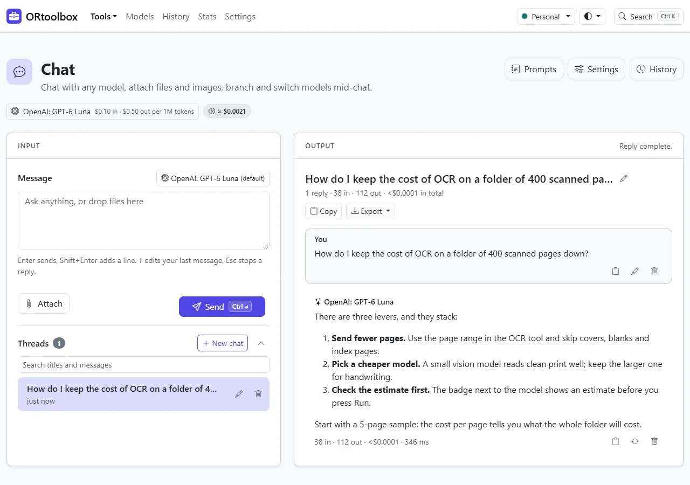
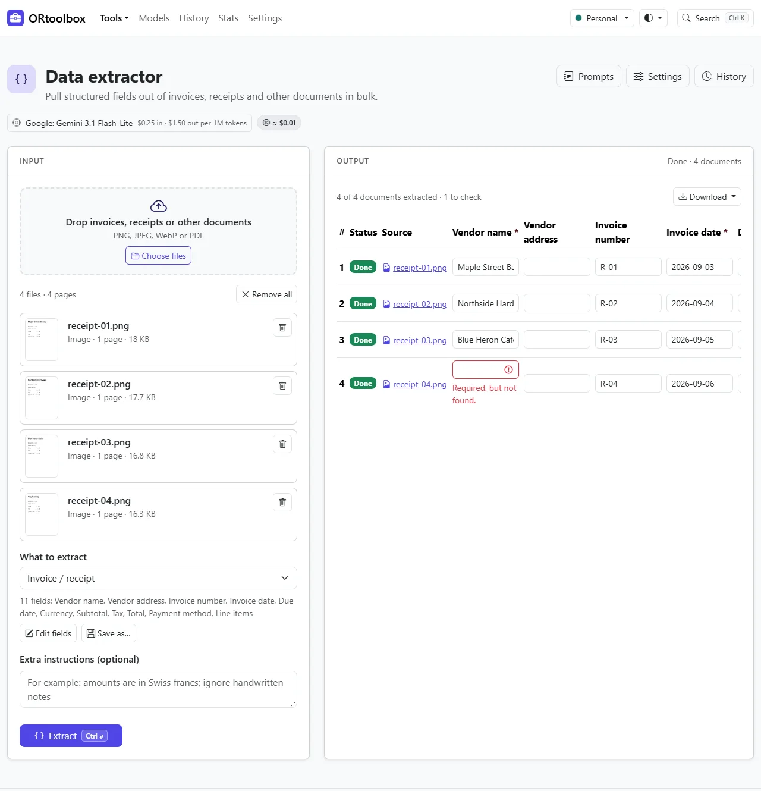
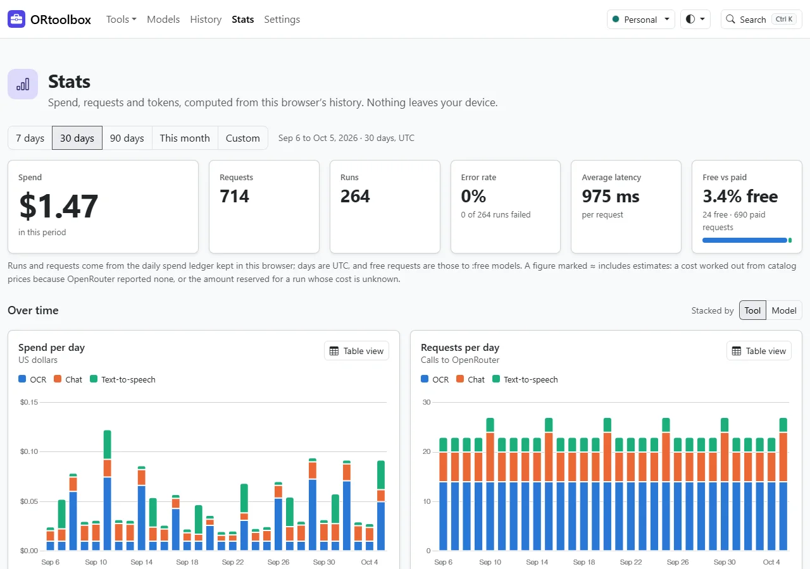

# ORtoolbox

ORtoolbox is a toolbox of 14 AI tools that runs entirely in your browser, on your own [OpenRouter](https://openrouter.ai) key. There is no server and no account: your key, settings, prompts and history stay in your browser, and the only service it talks to is OpenRouter. Chat, read documents, transcribe and speak, make images, music and video, and compare models, with the cost shown before you run and tracked after.

**Use it now: <https://ethanpil.github.io/or-toolbox/>** · [User guide](docs/user-guide.md)

<p align="center">
  
</p>

<table>
  <tr>
    <td width="33%"><br><sub>Chat: branches, attachments, per-reply cost.</sub></td>
    <td width="33%"><br><sub>Data extractor: review and correct before export.</sub></td>
    <td width="33%"><br><sub>Stats: spend and usage, computed locally.</sub></td>
  </tr>
</table>

<sub>Screenshots use sample data from a mocked OpenRouter.</sub>

## The tools

| Tool | What it does |
| --- | --- |
| [Chat](docs/user-guide.md#chat) | Chat with any model; attach files and images, branch and edit, switch models mid-chat. |
| [OCR](docs/user-guide.md#ocr) | Turn images and PDFs into Markdown, text or Word, including handwriting and math. |
| [Data extractor](docs/user-guide.md#data-extractor) | Pull structured fields out of invoices, receipts and other documents in bulk, review them in a grid, export JSON, CSV or XLSX. |
| [Table extractor](docs/user-guide.md#table-extractor) | Find tables and charts in pages, edit them as grids, export CSV, XLSX or Markdown. |
| [Speech-to-text](docs/user-guide.md#speech-to-text) | Record or upload audio and video of any length; get an editable transcript with timestamps, speakers and subtitles. |
| [Text-to-speech](docs/user-guide.md#text-to-speech) | Read long text aloud in a chosen voice, stitched into one MP3 or WAV. |
| [Music generation](docs/user-guide.md#music-generation) | Compose songs and instrumentals from a description, lyrics or an image. |
| [Image generation](docs/user-guide.md#image-generation) | Create images from a prompt, with variations, seeds and reference images. |
| [Image editor](docs/user-guide.md#image-editor) | Paint a mask to change, remove or extend parts of a picture, with a version history. |
| [Isolated image](docs/user-guide.md#isolated-image) | Put product photos on a pure white square, quality-checked and ready for a shop. |
| [Video studio](docs/user-guide.md#video-studio) | Generate, continue and extend clips, run multi-step sequences, then join them into one MP4. |
| [Decision](docs/user-guide.md#decision) | Ask yes/no, choice and score questions and get answers with probabilities. |
| [Bot-to-bot chat](docs/user-guide.md#bot-to-bot-chat) | Let two models talk to each other while you moderate, inside turn, time and cost limits. |
| [Model arena](docs/user-guide.md#model-arena) | Send one input to two to four models, vote blind, and compare answers, cost and speed. |

## Highlights

- **Free-only mode.** One switch limits everything to free models, swaps each task to the best free one and tells you which tools have none.
- **Budgets.** Pick Disabled, Warn or Hard stop, with a per-run threshold and monthly limits for the whole app and per key. Spend is counted locally from your own runs.
- **Costs in view.** An estimate before every run, the real cost after it, per-run records in History and a Stats dashboard by tool, model and key.
- **History and prompts.** Text-only history you can search, reopen, re-run with another model and export. Each tool keeps Recent and Saved prompts that restore the tool's settings too.
- **Your key, your way.** Connect with OpenRouter (OAuth) or paste a key. Several keys, per-tool key and model pinning, and an optional passphrase lock that encrypts keys at rest.
- **Backup and restore.** One `.ortoolbox.json` file, keys left out unless you add them, encrypted with a passphrase. Restore shows a preview and merges or replaces.
- **Light and dark themes**, an accent color, density and reduced-motion settings.
- **Keyboard and accessibility care.** Everything is reachable by keyboard, with visible focus, live status announcements and contrast checked in both themes. A command palette (Ctrl/Cmd+K) jumps to any tool, page, setting, run or model.
- **Offline shell.** A service worker keeps the app shell, so pages open without a network; the tools themselves need one.
- **Multi-threaded ffmpeg.** Video joining, audio stitching and conversion run in ffmpeg.wasm. GitHub Pages cannot send the headers it needs, so the service worker adds them (cross-origin isolation); a single-threaded fallback covers browsers that block it.

## Privacy and security

- **Nothing is stored remotely.** There is no ORtoolbox server, no analytics and no cookies. Keys and settings live in your browser's local storage, history, prompts and stats in IndexedDB. Images, audio, video and uploaded files stay in memory and are never written to disk; the page warns before you leave with results you have not downloaded.
- **Requests go only to openrouter.ai** (plus the site's own files from the static host). When you run a tool, your prompt and files go to OpenRouter and on to the model provider you chose. Free models are often served by providers that log or train on prompts, so keep private data off them. A per-key switch asks OpenRouter to prefer providers that do not retain data.
- **No third-party origins at runtime.** All scripts, fonts and the ffmpeg cores are bundled and self-hosted. The Content Security Policy (`script-src 'self'`, `connect-src` limited to the site and `https://openrouter.ai`, no inline scripts, no frames) makes everything else impossible, and model output rendered as Markdown is sanitized.
- **Keys are handled with care:** masked in the UI, never logged, never in a URL, never in History, excluded from backups unless you opt in. The optional passphrase lock encrypts them at rest (AES-GCM, key derived with PBKDF2). Use a key with a credit limit, so a leak can only spend that much.
- **Shared github.io origin.** On `ethanpil.github.io` every project site shares one origin, so another page on that address could read what ORtoolbox stores in your browser. Turn on the passphrase lock (it encrypts keys only, not history or settings), use a key with a small credit limit, or serve ORtoolbox from a custom domain, where this risk does not exist.

The in-app [Privacy page](https://ethanpil.github.io/or-toolbox/privacy/) says the same in more detail.

## Getting started

1. Open <https://ethanpil.github.io/or-toolbox/>.
2. Add a key. Press **Connect with OpenRouter** and approve, or paste an existing key (best one with a credit limit). Both are on Home and in Settings → Keys.
3. Try a free model: switch on "Use free models only" in the setup wizard (or **Free-only mode** in Settings → Default models), then open Chat, OCR, Text-to-speech or Decision, which all have free models. The wizard's **Try a sample** step opens a tool with an example already filled in.

The [user guide](docs/user-guide.md) covers keys, the passphrase lock, budgets, every tool, the platform pages and troubleshooting.

**Browsers:** current Chrome and Edge, Firefox and Safari. The automated tests run in Chromium, Firefox and WebKit. The Diagnostics page shows what your browser supports.

## Development

Requires Node.js 22.22.2+, 24.15+ or 26+ (the range jsdom supports).

```sh
npm install
npx playwright install chromium firefox webkit   # for the end-to-end tests
npm run dev                                      # http://localhost:5273/or-toolbox/
npm run check                                    # typecheck, lint, unit tests
npm run e2e                                      # build, then end-to-end tests
```

| Command | What it does |
| --- | --- |
| `npm run dev` | Vite dev server on port 5273 under `/or-toolbox/` (no service worker). |
| `npm run build` / `npm run preview` | Typecheck and build to `dist/`; serve it on port 4273 with the service worker and CSP active. |
| `npm run check` | Typecheck, lint and unit tests. Run it before sending a change. |
| `npm run e2e:dev -- <spec>` | Playwright against the dev server, for day-to-day work. |
| `npm run e2e` | Build, then the full Playwright suite against `preview` (the gate). |

The e2e tests talk only to a mocked OpenRouter; no test reaches the real API. CI (`.github/workflows/ci.yml`) runs the checks and the suite on Chromium, Firefox and WebKit, and deploys `main` to GitHub Pages.

Where to read next:

- [CLAUDE.md](CLAUDE.md): architecture rules, layout, conventions and the reasons behind non-obvious decisions. Read it before changing behavior.
- [docs/tool-authoring.md](docs/tool-authoring.md): how to build a tool on the shared shell.
- [PLAN.md](PLAN.md): the product plan and platform features.
- [docs/openrouter-api.md](docs/openrouter-api.md): the OpenRouter API facts the code is written against.
- [CHANGELOG.md](CHANGELOG.md): what changed.

## License

To be decided. There is no `LICENSE` file yet, so no permission to copy or reuse the code is granted until one is added.
